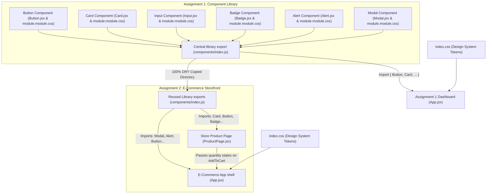
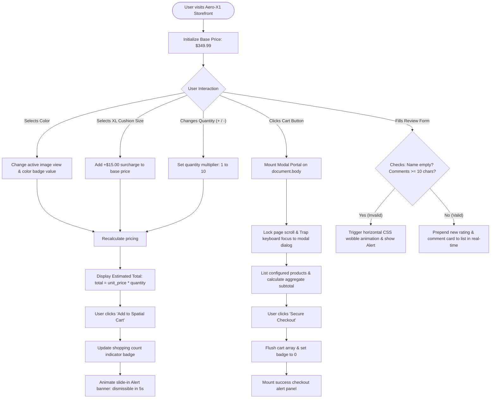
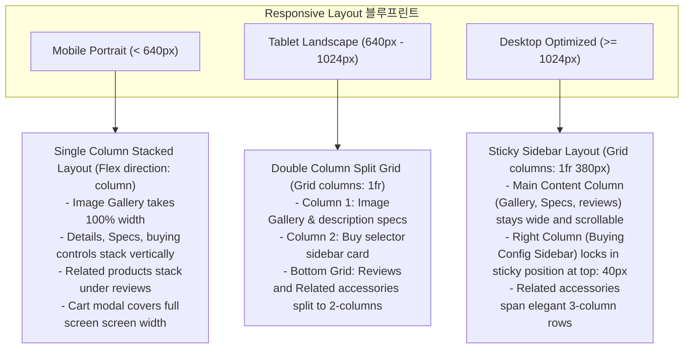

# Immersive React Assignment Suite: Master Developer Guide

Welcome to the comprehensive master documentation for the React Suite. This workspace contains two fully realized, high-fidelity React projects: a premium **BEM-structured Component Library** (`assignment-1`) and a **Responsive Cyberpunk E-Commerce Storefront** (`assignment-2`).

Both applications utilize a unified, ultra-premium visual system built on sleek dark HSL slate palettes, frosted glass surfaces, and responsive micro-animations, and are fully structured for complete screen-reader and keyboard accessibility.

---

## 📊 Master Architectural Flowcharts

### 1. Component Export, Import & Dependency Flow
This flowchart represents how the custom components are organized, consolidated, and distributed across both projects to enforce the **DRY (Don't Repeat Yourself)** principle.



---

### 2. E-Commerce State Machine & Purchase Flow
This flowchart illustrates the interactive logic inside `assignment-2`, showing how selecting color schemes, padding sizes, and quantities dynamically updates price calculations, cart states, overlays, and user reviews.



---

### 3. Responsive Screen Layout Grid Flow
This flowchart details the Mobile-First responsive CSS blueprint implemented across our style sheets to optimize layouts for variable viewport widths.



---

## 📂 Exhaustive Directory Tree

Here is a complete inventory of every single file within the workspace, alongside its specific engineering purpose:

### Root Project Space
*   `market/README.md` (This file) - Unified master guide explaining architecture, workflows, styling parameters, and execution scripts.

### 📦 [assignment-1] Component Library
*   `assignment-1/package.json` - Defines project metadata, dependencies (React 18/19, Lucide React icons), dev scripts, and Vite compiler configurations.
*   `assignment-1/vite.config.js` - Configuration properties instructing Vite on plugin parsing and Rolldown build optimizations.
*   `assignment-1/index.html` - Primary HTML page skeleton containing the root DOM node where the React application mounts.
*   `assignment-1/src/main.jsx` - Entrypoint script that loads global typography, CSS variables, and mounts `App.jsx` inside standard StrictMode.
*   `assignment-1/src/index.css` - Core design tokens, global resets, Google Fonts, responsive light/dark styles, and custom glowing neon scrollbars.
*   `assignment-1/src/App.jsx` - Central interactive showcase dashboard dividing components into structured demo cards with live state managers.
*   `assignment-1/src/App.css` - Layout controls, decorative background gradients, and alignment patterns for the showcase card decks.
*   **`assignment-1/src/components/`** - Centralized reusable and accessible component library.
    *   `index.js` - Global library exporter consolidating individual widgets to allow clean, destuctured destructured imports.
    *   **`Button/`** - Premium tactile button package.
        *   `Button.jsx` - Handles variants, sizes, disable controls, loading, and prefix/suffix Lucide icons.
        *   `module.module.css` - BEM CSS file defining 3D button press, hover translation lifts, and neon active rings.
        *   `index.js` - Standard component exporter routing back to `Button.jsx`.
    *   **`Card/`** - Layout surface container package.
        *   `Card.jsx` - Formats title blocks, subtitle strings, header actions, and custom bottom footer rows.
        *   `module.module.css` - Defines frosted glass backdrops, flat borders, and mouse hover shadows.
        *   `index.js` - Routes component defaults.
    *   **`Input/`** - Highly accessible text field container.
        *   `Input.jsx` - Maps labels to generated input IDs, links invalid alerts to screen-readers, and handles helper messages.
        *   `module.module.css` - Styles active neon border shadows, disabled fields, and horizontal wobble keyframe animations.
        *   `index.js` - Standard package router.
    *   **`Badge/`** - Compact tag labelling capsule.
        *   `Badge.jsx` - Wraps tag text with inline prefix icons.
        *   `module.module.css` - Styles filled solid states, high-contrast borders, and glowing glass tag labels.
        *   `index.js` - Standard package router.
    *   **`Alert/`** - System event notification banner.
        *   `Alert.jsx` - Displays automatic system icons based on type (success, info, warning, error) with dismiss buttons.
        *   `module.module.css` - Powers sliding entry animations, backdrop blurs, and glow outlines.
        *   `index.js` - Standard package router.
    *   **`Modal/`** - High-focus dialog box package.
        *   `Modal.jsx` - Renders portal to document body, traps focus, listens for Escape key triggers, and locks page scroll.
        *   `module.module.css` - Defines scale expansions, blurred page overlays, and viewport-specific sizing.
        *   `index.js` - Standard package router.

### 🛒 [assignment-2] Responsive Cyberpunk E-Commerce Store
*   `assignment-2/package.json` - Developer dependencies and script configurations for Assignment 2.
*   `assignment-2/public/` - Holds real high-definition product mockup images copy-routed to render dynamically in the product gallery.
    *   `headset-main.png` - Ultra-premium cyberpunk audio device main pedestal image.
    *   `headset-detail.png` - Hinge and metallic texture close-up detail image.
    *   `headset-dock.png` - Headphones folded inside neon cyan magnetic case dock image.
*   `assignment-2/src/main.jsx` - Renders the storefront application under body portals.
*   `assignment-2/src/index.css` - Replicates global HSL variables to maintain consistent branding.
*   `assignment-2/src/App.jsx` - Storefront coordinator, tracks item counts, pricing totals, checkout validation forms, and secure checkout alerts.
*   `assignment-2/src/App.css` - Global navigation headers, logo dot pulsing animations, and cart slide-down overlay sheets.
*   **`assignment-2/src/components/`** - Replicated 100% DRY components directory copied directly from Assignment 1.
*   **`assignment-2/src/pages/ProductPage/`** - Immersive product detail section.
    *   `ProductPage.jsx` - Interactive image gallery selection, product specification cards, color/size selection arrays, quantity counters, and customer review additions.
    *   `ProductPage.module.css` - Controls multi-column split layout panels, responsive media queries, specs grids, and reviews tables.

---

## 🎨 Unified Design System & Tokens (`index.css`)

Both projects share a cohesive design token system in their respective `index.css` files, allowing easy visual maintenance:

| Token Category | Variable Name | Theme / Value | Visual Impact / Description |
| :--- | :--- | :--- | :--- |
| **App Background** | `--bg-app` | `hsl(240, 10%, 4%)` | Deep midnight slate; provides premium high-contrast base. |
| **Surface Plate** | `--bg-surface` | `hsl(240, 10%, 8%)` | Elevated surface layers; wraps cards, inputs, and sidebars. |
| **Surface Hover** | `--bg-surface-hover` | `hsl(240, 10%, 12%)` | Soft highlight glow when hovering over surface decks. |
| **Text Primary** | `--text-main` | `hsl(0, 0%, 96%)` | Off-white, readable font color ensuring maximum visibility. |
| **Text Secondary**| `--text-secondary` | `hsl(240, 4%, 70%)` | Slate gray; ideal for specifications, details, and subtitles. |
| **Primary Color** | `--color-primary` | `hsl(262, 85%, 60%)` | Electric royal violet; fuels main buttons, badges, and glows. |
| **Success Color** | `--color-success` | `hsl(142, 75%, 45%)` | Deep emerald green; indicates positive alerts and in-stock items. |
| **Warning Color** | `--color-warning` | `hsl(38, 85%, 50%)` | Amber gold; maps warning notifications and star reviews. |
| **Danger Color** | `--color-danger` | `hsl(350, 80%, 55%)` | Crimson rose red; warns errors, delete buttons, and invalid fields. |
| **Info Color** | `--color-info` | `hsl(200, 80%, 55%)` | Sky blue; handles links and information alerts. |
| **Small Shadow** | `--shadow-sm` | `0 2px 8px -2px rgba(0,0,0,0.5)`| Soft contact shadow under inputs and badges. |
| **Medium Shadow**| `--shadow-md` | `0 8px 24px -4px rgba(0,0,0,0.6)`| Pronounced floating shadow under cards and gallery grids. |
| **Large Shadow** | `--shadow-lg` | `0 16px 40px -8px rgba(0,0,0,0.8)`| Deep 3D overlay shadow under modals and alerts. |

---

## 🛠️ Complete Component Specification Guide (Assignment 1)

### 1. `Button` Component
A tactile, accessible button built to adapt from minimalistic inline layouts to huge full-width action callouts.

*   **Props Table:**
    *   `children` (*node, required*): Text or elements displayed in the button core.
    *   `variant` (*string*): Options: `'primary'` (violet gradient), `'secondary'` (glass slate), `'outline'` (border-glow), `'ghost'` (no-background), `'success'`, `'warning'`, `'danger'`. Default: `'primary'`.
    *   `size` (*string*): Options: `'sm'`, `'md'`, `'lg'`. Default: `'md'`.
    *   `disabled` (*boolean*): Stops user interactions, reduces opacity to `45%`, sets cursor to `not-allowed`, and strips hover translations.
    *   `icon` (*node*): Lucide icon tag inserted inside the button.
    *   `iconPosition` (*string*): Options: `'left'`, `'right'`. Default: `'left'`.
*   **BEM Classes:**
    *   `.btn` (Block) - Set display flex, centers items, hooks `transition: transform 0.15s`.
    *   `.btn--[variant]` (Modifier) - Assigns background gradients, custom hover glow, and active border hues.
    *   `.btn--[size]` (Modifier) - Adjusts padding values, font sizes, and height properties.
    *   `.btn--disabled` (Modifier) - Strips contact shadows and scales.
    *   `.btn__content` (Element) - Flex wrap alignment for button labels.
    *   `.btn__icon` (Element) - Scales icon slightly (`scale(1.1)`) on button hover.

---

### 2. `Card` Component
An essential surface structural widget for framing details with visual hierarchy.

*   **Props Table:**
    *   `title` (*node*): Main display header text.
    *   `subtitle` (*node*): Small secondary gray font line.
    *   `children` (*node, required*): Content body rendered in the central card zone.
    *   `footer` (*node*): Bottom deck containing checkout controls or read-more links.
    *   `headerActions` (*node*): Layout slot inside the top right corner for tags or close buttons.
    *   `variant` (*string*): Options: `'default'` (solid surface), `'glass'` (backdrop blur), `'flat'` (thin borders), `'bordered'` (glowing neon top strip). Default: `'default'`.
    *   `interactive` (*boolean*): Enables hover lift animations (`translateY(-4px)`), cursor changes, and active click outlines.
    *   `onClick` (*function*): Action callback. Automatically triggers `interactive={true}` and binds keyboard accessibility listener.
*   **BEM Classes:**
    *   `.card` (Block) - Sets solid background, outlines, and contact shadows.
    *   `.card--[variant]` (Modifier) - Assigns backdrop-filters or top-border gradients.
    *   `.card--interactive` (Modifier) - Activates transitions and lifts.
    *   `.card__header` (Element) - Organizes headers and actions with a flex space-between row.
    *   `.card__title` (Element) - Space Grotesk header styling.
    *   `.card__body` (Element) - Adapts padding based on header presence.
    *   `.card__footer` (Element) - Borders top line and darkens bottom background block.

---

### 3. `Input` Component
A text entry layout engineered with full validation bindings and screen-reader anchors.

*   **Props Table:**
    *   `label` (*string*): Label text placed above the field.
    *   `placeholder` (*string*): Ghost text shown in empty states.
    *   `type` (*string*): Standard input types (e.g. `'text'`, `'email'`, `'password'`). Default: `'text'`.
    *   `error` (*string*): Validation error message. Triggers a red outline and wobble animation.
    *   `helperText` (*string*): Informational text beneath the field.
    *   `icon` (*node*): Lucide icon prefix aligned within the field.
    *   `disabled` (*boolean*): Disables text entry and darkens background.
    *   `required` (*boolean*): Marks field with a red asterisk (`*`).
*   **BEM Classes:**
    *   `.input-group` (Block) - Vertical flex grid mapping items.
    *   `.input-group--error` (Modifier) - Links wobble animation to field containers.
    *   `.input-group--disabled` (Modifier) - Strips cursor entry.
    *   `.input-group__field` (Element) - Formats text inputs, custom focus rings, and placeholders.
    *   `.input-group__icon` (Element) - Shifts position to sit inline on the left edge.
    *   `.input-group__error-msg` (Element) - Red alert label mapping errors.

---

### 4. `Badge` Component
Sleek capsule tags designed to draw attention to statuses or metadata.

*   **Props Table:**
    *   `text` (*string*): Badge label text.
    *   `color` (*string*): Options: `'primary'`, `'secondary'`, `'success'`, `'warning'`, `'danger'`, `'info'`. Default: `'primary'`.
    *   `size` (*string*): Options: `'sm'`, `'md'`, `'lg'`. Default: `'md'`.
    *   `variant` (*string*): Options: `'filled'` (solid color), `'outline'` (border only), `'glass'` (translucent glow). Default: `'glass'`.
    *   `icon` (*node*): Tiny icon prefix placed beside label.
*   **BEM Classes:**
    *   `.badge` (Block) - Inline flex alignment, capsule border radius (`9999px`), letter-spacing.
    *   `.badge--[size]` (Modifier) - Compact padding multipliers.
    *   `.badge--[variant]` (Modifier) - Handles background solid colors or gradients.

---

### 5. `Alert` Component
Noticeable system banners built with automatic theme-matching icons and dismiss transitions.

*   **Props Table:**
    *   `type` (*string*): Options: `'success'`, `'warning'`, `'error'`, `'info'`. Default: `'info'`.
    *   `message` (*node, required*): The primary body message.
    *   `title` (*string*): Bold header title text.
    *   `onClose` (*function*): Triggered when dismiss button is clicked (includes transition delays).
    *   `icon` (*node*): Custom icon override.
*   **BEM Classes:**
    *   `.alert` (Block) - Flex row layout, slide-in animation trigger, borders.
    *   `.alert--[type]` (Modifier) - Maps system colors (e.g. green for success, red for error).
    *   `.alert__content` (Element) - Vertical flex column arranging headers and messages.
    *   `.alert__close` (Element) - Accessible dismiss button with translucent hover rings.

---

### 6. `Modal` Component
An immersive, portal-based overlay card built to dominate the focus layout.

*   **Props Table:**
    *   `isOpen` (*boolean, required*): Controls overlay visibility.
    *   `title` (*string, required*): Header title text.
    *   `children` (*node, required*): Main layout content rendered in the modal.
    *   `onClose` (*function, required*): Close callback triggered by clicks or ESC.
    *   `footer` (*node*): Layout row at the bottom for confirm/cancel controls.
    *   `size` (*string*): Options: `'sm'` (`440px`), `'md'` (`600px`), `'lg'` (`800px`), `'xl'` (`1140px`), `'full'` (fullscreen). Default: `'md'`.
    *   `closeOnOverlayClick` (*boolean*): Close if background mask is clicked. Default: `true`.
    *   `closeOnEsc` (*boolean*): Close if Escape key is pressed. Default: `true`.
*   **BEM Classes:**
    *   `.modal` (Block) - Fixed full-page background mask with a blur filter and a `fadeIn` animation.
    *   `.modal__dialog` (Element) - Solid modal content card using a spring scale keyframe (`scaleUp`).
    *   `.modal__dialog--[size]` (Modifier) - Adjusts max-widths.
    *   `.modal__header` (Element) - Divider row separating header elements.
    *   `.modal__body` (Element) - Activates vertical scrollbars for long content.
    *   `.modal__close` (Element) - Translucent floating close button.

---

## 🛒 Premium E-Commerce Storefront Details (Assignment 2)

`assignment-2` uses our Component Library to construct a high-end storefront featuring a premium headphones detail page.

### 🌟 Advanced Features
1.  **Interactive Image Gallery:** Renders a main product image using responsive bounds. Clicking interactive thumbnails swaps the source image instantly with fading filters.
2.  **Pricing State Engine:** Dynamically calculates pricing in real-time depending on:
    *   Selected Cushion Foam: Comfort Foam (Included) or XL Cooling Cushion Foam (adds a `+$15.00` surcharge).
    *   Selected Quantities: Integrates responsive add/subtract controls, tracking purchases from 1 up to a max of 10 items.
3.  **Sticky Purchasing Sidebar:** A layout panel that remains fixed in position while the user scrolls. Displays item metadata, total sum calculations, checkout shortcuts, and shipping promises.
4.  **Verified Reviews Feed:** Renders customer reviews inside frosted `Card` layouts. Features a rating selector that appends user reviews to the feed in real-time.
5.  **Simulated Checkout System:** Adds products to your cart and increments a persistent navigation count badge. Clicks on the cart logo mount a modal listing order items and subtotals, leading to secure checkouts that flush state values and trigger success alerts.

---

## 🚀 Installation & Local Development Launch

Follow these simple instructions to download dependencies, start local hot-rebuilding dev servers, or verify production builds.

### 📋 Prerequisites
Confirm that you have [Node.js](https://nodejs.org/) installed:
```powershell
node --version
# Expected: v18.0.0 or higher
```

### 💻 Step-by-Step Commands

#### 1. Launch Assignment 1 (Component Library Showcase)
```powershell
# Navigate into the Assignment 1 project directory
cd assignment-1

# Download packages and setup Lucide icons
npm install

# Start local dev server (default port: http://localhost:5173/)
npm run dev
```

#### 2. Launch Assignment 2 (Responsive E-Commerce Store)
```powershell
# Navigate into the Assignment 2 project directory
cd assignment-2

# Download packages and setup Lucide icons
npm install

# Start local dev server (default port: http://localhost:5173/)
npm run dev
```

#### 3. Production Build Validation
To verify compiling and bundling without error warnings:
```powershell
# Inside either assignment directory
npm run build
```
The compiled HTML, CSS modules, and bundled scripts will be outputted to `/dist` directories ready for static host serving.

---

## 🛡️ Developer Troubleshooting FAQ

*   **Vite CSS Modules are compiling as blank files:**
    *   *Why:* Vite only parses files ending in `.module.css` as local modules. Standard `.css` files are treated as global scripts.
    *   *Solution:* We have explicitly named all component styling packages as `[ComponentName].module.module.css` (e.g. `module.module.css`) to enforce component folder scoping without breaking compiler rules.
*   **Modal portal is not mounting inside the DOM:**
    *   *Why:* Modal relies on React's `createPortal(..., document.body)`. If the DOM body element is not fully initialized, the portal script fails.
    *   *Solution:* The script uses a microsecond time delay (`setTimeout`) to guarantee the mounting container is loaded before focus trapping loops trigger.
*   **Mermaid Flowcharts are not rendering inside my text editor:**
    *   *Why:* Markdown viewers require active Mermaid parsing engines to compile graph codes.
    *   *Solution:* Install a "Markdown Preview Mermaid Support" plugin inside VS Code or host compile the code in your browser's Markdown viewer.
